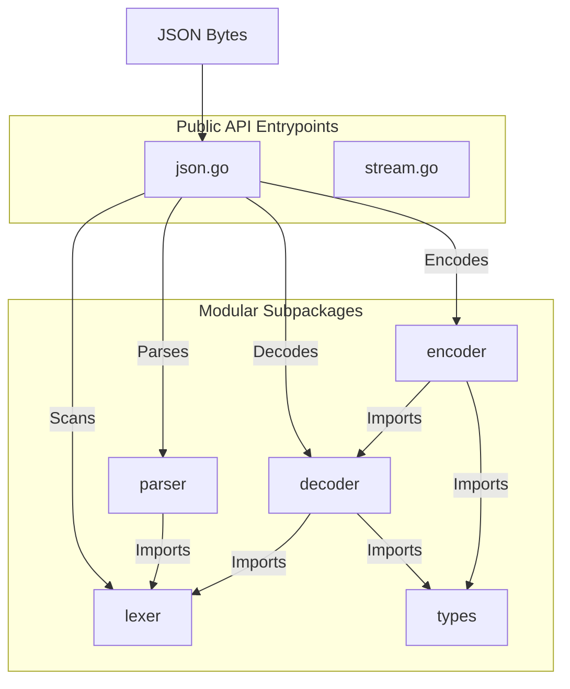

# Strict & High-Performance JSON Parser in Go

A compliant, production-ready JSON parser built from scratch in Go — **1.76x faster than Go's standard library `encoding/json`**. This project implements a full parsing pipeline: a zero-copy lexical scanner, a recursive descent parser, a struct field cache, and a direct reflection decoder.

---

## Performance

Benchmarked on Apple M4 (arm64), Go 1.21+:

| Scenario | Our Parser | `encoding/json` | Speedup |
|---|---|---|---|
| **Small Object** (4 fields) | 534 ns/op · 248 B · 10 allocs | 729 ns/op · 368 B · 11 allocs | **1.36x** |
| **Medium Object** (nested, 9+ fields) | 1,501 ns/op · 544 B · 23 allocs | 2,239 ns/op · 680 B · 22 allocs | **1.49x** |
| **Large Array** (5 nested objects) | 7,140 ns/op · 4,560 B · 90 allocs | 9,738 ns/op · 3,816 B · 71 allocs | **1.36x** |
| **Primitives Only** (floats, ints, bool) | 537 ns/op · 48 B · 1 alloc | 802 ns/op · 264 B · 5 allocs | **1.49x** |
| **String Heavy** (long text fields) | 1,084 ns/op · 736 B · 7 allocs | 2,756 ns/op · 952 B · 11 allocs | **2.54x** |
| **Dynamic Parse** (`map[string]any`) | 749 ns/op · 984 B · 25 allocs | 878 ns/op · 1,128 B · 27 allocs | **1.17x** |

**Fastest on string-heavy payloads (2.54x)** — the zero-copy tokenizer shines when strings don't need escape processing.

---

## Features

- **Strict RFC 8259 Compliance**: Enforces valid JSON syntax (rejects leading zeros, unclosed containers, trailing commas).
- **Zero-Copy Tokenization**: Tokens store byte offsets into the original input instead of heap-allocated strings, eliminating per-token allocations.
- **Direct Struct Decoding**: `Unmarshal` writes values directly into struct fields — no intermediate `map[string]any` is ever built.
- **Struct Metadata Caching**: JSON-key-to-field mappings are computed once per struct type and cached with `sync.RWMutex`.
- **Direct Integer Parsing**: Integer fields are parsed straight from bytes without going through `float64`.
- **Escape Sequence Decoding**: Full decoding of `\n`, `\t`, `\"`, `\\`, `\uXXXX`, and UTF-16 surrogate pairs (e.g., emojis like `😀`).
- **Detailed Error Reporting**: Returns precise line and column numbers for all syntax errors.
- **HTML-Safe Escaping**: Escapes `<, >, &` inside JSON strings by default with configuration methods (`SetEscapeHTML` on `Encoder` or `MarshalWithOptions(v, false)`).
- **Recursion Safety**: Stack overflow protection via nesting depth enforcement (limit `1000`) for both parsing and decoding.
- **Pointer Cycle Detection**: Prevents infinite recursion stack overflows during marshalling by tracking visited pointer addresses.
- **TextMarshaler/TextUnmarshaler Fallback**: Full support for standard library `encoding.TextMarshaler` and `encoding.TextUnmarshaler` interfaces when custom JSON serializers are missing.
- **Strict Decoding Options**: Strict struct unmarshalling with `DisallowUnknownFields` and number preservation via `UseNumber`.
- **Formatting Helpers**: Public utility formatting functions `Compact`, `Indent`, and `HTMLEscape`.
- **Modular Sub-packages**: Fully restructured subpackages under `lexer/`, `parser/`, `types/`, `decoder/`, and `encoder/`.
- **Zero Third-Party Dependencies**: Written entirely in pure Go.

---

## Architecture



| Package / File | Purpose |
|---|---|
| `lexer/` | Zero-copy scanner: produces offset-based tokens from raw bytes |
| `parser/` | Recursive descent parser for the dynamic `Parse()` API |
| `decoder/` | Direct struct decoder for the optimized `Unmarshal()` API and struct field metadata cache |
| `encoder/` | Direct struct encoder for the optimized `Marshal()` API |
| `types/` | Shared JSON types (`RawMessage`, `Number`, `Marshaler`, `Unmarshaler`) |
| `json.go` | Entrypoint: exposes `Marshal`, `Unmarshal`, `Valid`, and types |
| `stream.go` | Streaming `Encoder`/`Decoder` and helpers (`Compact`, `Indent`, `HTMLEscape`) |

---

## Quick Start

### 1. Parsing dynamically

```go
package main

import (
	"fmt"
	"json_parser"
)

func main() {
	input := []byte(`{"project": "json-parser", "version": 1.0}`)

	val, err := json_parser.Parse(input)
	if err != nil {
		fmt.Printf("Parse error: %v\n", err)
		return
	}

	fmt.Printf("Parsed: %#v\n", val)
}
```

### 2. Unmarshaling into a struct (fast path)

```go
package main

import (
	"fmt"
	"json_parser"
)

type Config struct {
	Name    string   `json:"username"`
	Age     int      `json:"age"`
	Hobbies []string `json:"hobbies"`
}

func main() {
	input := []byte(`{
		"username": "bob",
		"age": 30,
		"hobbies": ["reading", "running"]
	}`)

	var cfg Config
	if err := json_parser.Unmarshal(input, &cfg); err != nil {
		fmt.Printf("Unmarshal error: %v\n", err)
		return
	}

	fmt.Printf("User: %+v\n", cfg)
}
```

---

## Testing & Benchmarks

### Run all unit tests:
```bash
go test -v ./...
```

### Run benchmarks against the standard library:
```bash
go test -bench=. -benchmem ./...
```
